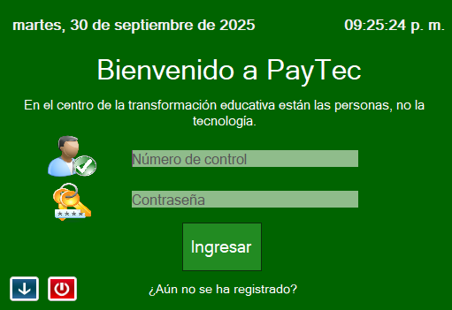

# 🧮 Química - PayTec

Este proyecto es una aplicación diseñada para gestionar el pago de inscripciones, cursos y el historial académico de estudiantes en el área de la química. Pensada para instituciones educativas, este sistema permite llevar un control eficiente de usuarios (alumnos), pagos, cursos y relaciones con los maestros **en C#**.

Características principales:

- Gestión de usuarios: Registro y consulta de alumnos y maestros.
- Pagos e inscripciones: Registro de pagos por curso, historial de inscripciones y control de adeudos.
- Historial académico: Visualización del historial de cursos inscritos por cada alumno.
- Vista personalizada: Los maestros pueden acceder a los datos de sus alumnos, incluyendo inscripciones y progreso.
- Interfaz intuitiva: Diseñada para facilitar el uso tanto para personal administrativo como docente.

Este sistema busca simplificar el proceso administrativo dentro de instituciones educativas relacionadas con la enseñanza de la química, centralizando la información académica y financiera en una sola plataforma.

---

## 📷 Captura del Programa

---

## 🛠 Tecnologías usadas

- C# (.NET Framework)
- Windows Forms
- Base de datos MySQL

---

## 🚀 Cómo ejecutar

1. Abre el proyecto con Visual Studio
2. Compila y ejecuta (F5)
3. Puedes los Insert, Update, Delete, Select

---

## ✍️ Autor

- Carlos Alberto Medina Beltran
